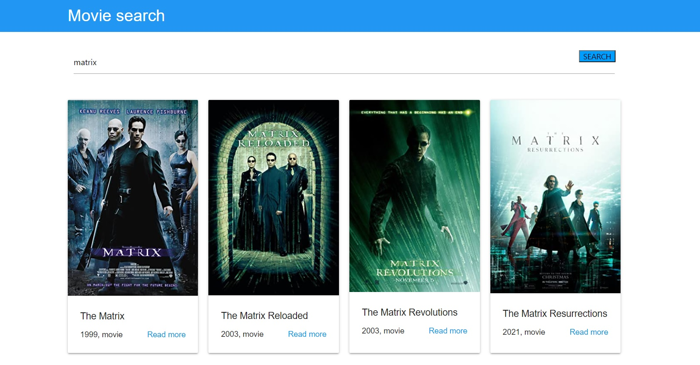

# Поисковик фильмов с использованием React

## Как выполнить поиск:
Для начала мышкой кликнуть в поисковую строку и ввести фильм который надо найти. Далее курсором мышки кликнуть на кнопку "Search". Ниже будут представлены все найденные фильмы по запросу.

## Как скачать себе?
+ Открыть на своей локальной машине git bash и ввести команду git clone https://github.com/dron-olya7/movie-search.git 
+ Далее открыть среду разработки и перенести скаченную папку в открытую область или же через файл -> открыть папку -> выбрать папку либо через набор клавиш
+ Набрать команду npm start.